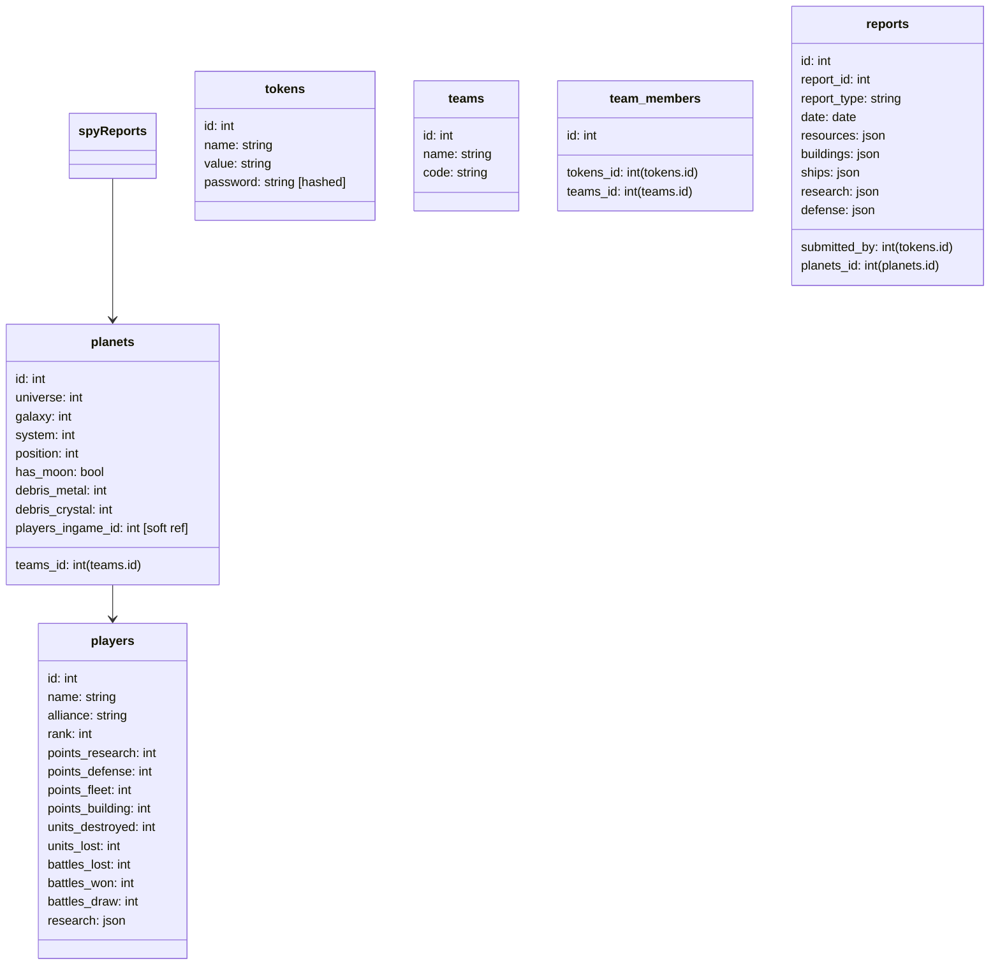

# Teamview for pr0game

## Other Scripts

- `setupDb.js`: run once to initialize local postgresdb, credentials provided via `.env`
- `importStats.js`: loads the /stats.json file from the server and dumps it into the players table (does not update, creates new entry each time)
- `createToken.js`: bootstrap your DB with a first token

## Required use cases

| usecase | auth level | payload (H:eader) | route | returns |
|---------|------------|------------|-------|---------|
| create API token (=new user) | none | H:password, username/comment | POST /`v1/tokens` | token |
| delete API token | password | H:password | DELETE `/v1/tokens/<token>`| success |
| create a team | token | token, teamName | POST /v1/teams | team ID, teamCode (required to join) |
| retrieve a teams passcode | none (you must be part of the team) | none | GET `/v1/teams/<teamID>/passcode` | passcode
| join a team | password | H:password, H:teamCode, token | POST `/v1/teams/join` | success |
| leave a team | password | H:password, token | DELETE `/v1/teams/<teamID>/members` | success |
| add planet data | none | array of planet info, token | POST `/v1/planets`
| add player data | none | array of player info, token | POST `/v1/players`

Limitations:
1. deleting an API token or leaving a team does not remove the data that has been already sent
1. there is no way to delete submitted data
1. an API tokens password cannot be recovered
1. deleting a team is only possible for the last remaining member
1. each token can only be assigned to one team, each browser plugin can only have one token (=one player can belong to one team only)
1. maximum number of members in a team is limited to 30

## DB structure

The respective classes in `lib/data` use camelCase notation instead of snake_case.
To convert to/from DB format each class has a .toDBformat() method that converts the case.
To create a new object from a DB result, rather than using the constructor use the static method `Class.fromDB()`

## Todo

- [ ] check that valid player id is taken for planets (players get inserted over and over..should not reference old entry)
- [ ] remove team feature
- [ ] add team feature
## Ideas

### Prevent API spam by implementing rate limit

Especially for POST/DELETE operations

- either via proxy https://faun.pub/prevent-ddos-attacks-with-traefik-2-44fb32eeac4f
- or in app https://www.npmjs.com/package/express-slow-down

## Development

- use vscode for devcontainer magic
- use https://github.com/sqlectron/sqlectron-gui/releases for working with the database
