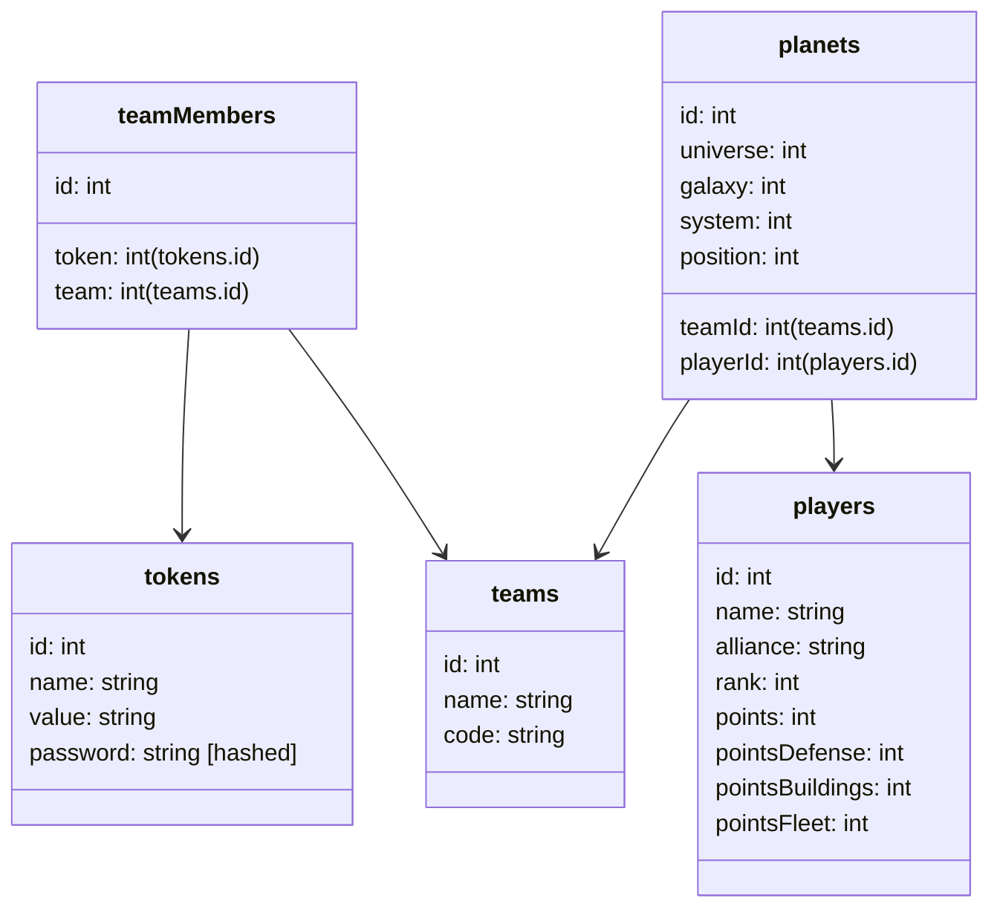

# 0game Teamview

## Required use cases

| usecase | auth level | payload (H:eader) | route | returns |
|---------|------------|------------|-------|---------|
| create API token (=new user) | none | H:password, username/comment | POST /`v1/tokens` | token |
| delete API token | password | H:password | DELETE `/v1/tokens/<token>`| success |
| create a team | password | H:password, teamName | POST /v1/teams | team ID, teamCode (required to join) |
| retrieve a teams passcode | none (you must be part of the team) | none | GET `/v1/teams/<teamID>/passcode` | passcode
| join a team | password | H:password, H:teamCode | POST `/v1/tokens/<token>/teams/<teamID>` | success |
| leave a team | password | H:password | DELETE `/v1/tokens/<token>/teams/<teamID>` | success |
| add galaxy data | none | array of planet info | POST `/v1/tokens/<token>/planets`

Limitations:
1. deleting an API token or leaving a team does not remove the data that has been already sent
1. there is no way to delete submitted data
1. an API tokens password cannot be recovered
1. deleting a team is only possible for the last remaining member

## DB structure

