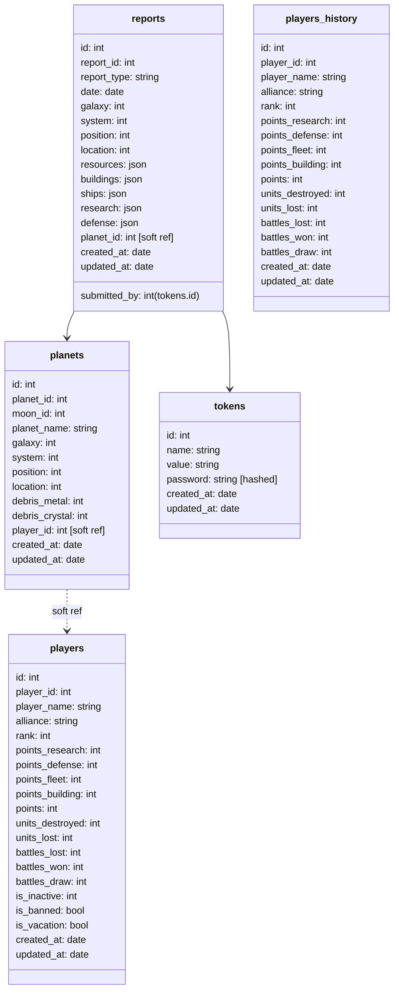

# Teamview for pr0game


## Development

For active development run the userscript build and server in development mode:

First create a `.env` filed based on the template.

```sh
npm run dev # starts and autoreleads server on localhost:3000
# second session
cd userscript
npm run dev # autobuilds userscript in case of changes
```

Switch to your browser with the userscript already installed and run `TM_setValue('developer_mode', 1)` (or change the `developer_mode` variable in the tampermonkey storage of the teamview script).

### Recommended tools

Use vscode for devcontainer with port forwarding to host

Install https://github.com/sqlectron/sqlectron-gui/releases for working with the database.
PostgreSQL port is forwarded from devcontainer to host.
Simply connect to `localhost:5432` with username/password/dbname = `postgres`

## Repo structure

```
teamview/
├─ index.js             Main entry file to start the backend server
├─ lib/
│  ├─ data/             Data models that are used to represent the game data, called by API methods and access the database
│  ├─ routes/           Express route definitions
│  ├─ db.js             Returns a shared instance of knex database driver already connected.  
│  ├─ server.js         Express server object
├─ public/              Contains the setup.user.js proxy script for tampermonkey and the output of running the userscript build (teamview.js)
├─ userscript/          Userscript files and build instructions. Execute npm run build in the userscript folder to create public/teamview.js file
│  ├─ teamview.js       Main entry point for userscript
│  ├─ ..
├─ docker-compose.yml   (Production) config for teamview
├─ setupDb.js           Run once to initialize local postgresdb, credentials provided via `.env`
├─ importStats.js       Loads the /stats.json file from the server and dumps it into the players table (does not update, creates new entry each time), only inserts if new data is available
├─ createToken.js       Create a new user token, value will be logged to stdout
```

## API Spec

See apidoc or run `npm run apidoc` and browse the `public/api` folder.
On a running instance the API spec is served on `/api`.

## DB structure

Each table with planet coordinates also has an auto-generated `location` column that can be used to easily compare planets exact locations.
`location` is calculated as `galaxy * 1000000 + system * 1000 + position`.



The respective classes in `lib/data` use camelCase notation instead of snake_case.
To convert to/from DB format each class has a .toDBformat() method that converts the case.
To create a new object from a DB result, rather than using the constructor use the static method `Class.fromDB()`

### Format of espionage report objects (in DB and API)

Content of espionage reports is aggregated into JSON objects for `resources`, `buildings`, `ships`, `defense`, `research`.

Translations from espionage report to these keywords is defined in `userscript/spioParser.js`.

#### Resources
```
metal
crystal
deuterium
```

#### Buildings

```
metalMine
crystalMine
deuteriumRefinery
solarPowerPlant
university
deuteriumPowerPlant
robotFactory
naniteFactory
shipyard
metalStorage
crystalStorage
deuteriumStorage
researchLab
terraformer
allianceDepot
moonBase
phalanxSensor
jumpgate
missileSilo
```

#### Ships

```
lightCargo
heavyCargo
lightFighter
heavyFighter
cruiser
battleship
colonyShip
recycler
spyProbe
planetBomber
solarSatellite
starFighter
battleFortress
battleCruiser
```

#### Defense

```
missileLauncher
lightLaserTurret
heavyLaserTurret
gaussCannon
ionCannon
plasmaCannon
smallShieldDome
largeShieldDome
interceptor
interplanetaryMissiles
```

#### Research

```
spyTechnology
computerTechnology
weaponsTechnology
shieldTechnology
armourTechnology
energyTechnology
hyperspaceTechnology
combustionEngine
impulseEngine
hyperspaceEngine
laserTechnology
ionTechnology
plasmaTechnology
intergalacticResearchNetwork
expeditionResearch
mineralResearch
semiCrystalsResearch
fuelResearch
gravitonResearch
```

## Production

It is recommended to use `logrotation` to swap the logs in the `./logs` folder on a regular basis.
