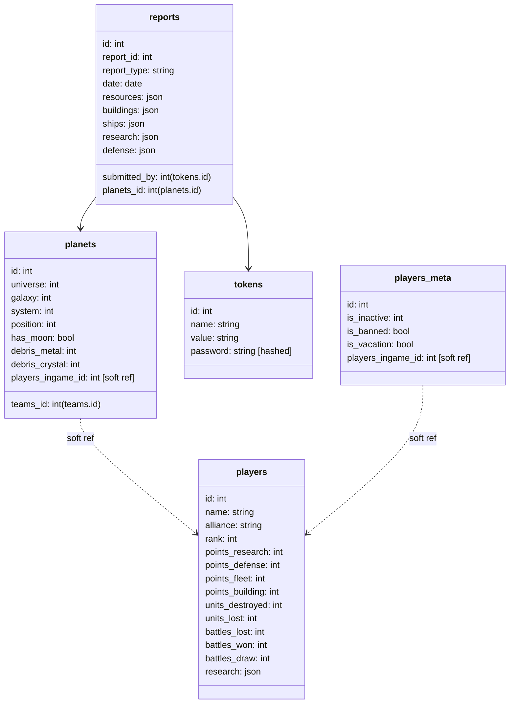

# Teamview for pr0game


## Development

For active development run the userscript build and server in development mode:

```sh
npm run dev # starts and autoreleads server on localhost:3000
# second session
cd userscript
npm run dev # autobuilds userscript in case of changes
```

### Recommended tools
Use vscode for devcontainer with port forwarding to host

Install https://github.com/sqlectron/sqlectron-gui/releases for working with the database.
PostgreSQL port is forwarded from devcontainer to host.
Simply connect to `localhost:5432` with username/password/dbname = `postgres`

## Repo structure

```
teamview/
├─ index.js             Main entry file to start the backend server
├─ lib/
│  ├─ data/             Data models that are used to represent the game data, called by API methods and access the database
│  ├─ routes/           Express route definitions
│  ├─ db.js             Returns a shared instance of knex database driver already connected.  
│  ├─ server.js         Express server object
├─ public/              Contains the setup.user.js proxy script for tampermonkey and the output of running the userscript build (teamview.js)
├─ userscript/          Userscript files and build instructions. Execute npm run build in the userscript folder to create public/teamview.js file
│  ├─ teamview.js       Main entry point for userscript
│  ├─ ..
├─ docker-compose.yml   (Production) config for teamview
├─ setupDb.js           Run once to initialize local postgresdb, credentials provided via `.env`
├─ importStats.js       Loads the /stats.json file from the server and dumps it into the players table (does not update, creates new entry each time), only inserts if new data is available
├─ createToken.js       Create a new user token, value will be logged to stdout
```

## API Spec

See apidoc or run `npm run apidoc` and browse the `public/api` folder.

## DB structure



The respective classes in `lib/data` use camelCase notation instead of snake_case.
To convert to/from DB format each class has a .toDBformat() method that converts the case.
To create a new object from a DB result, rather than using the constructor use the static method `Class.fromDB()`

## Todo

- [ ] add team feature

## Ideas

### Prevent API spam by implementing rate limit

Especially for POST/DELETE operations

- either via proxy https://faun.pub/prevent-ddos-attacks-with-traefik-2-44fb32eeac4f
- or in app https://www.npmjs.com/package/express-slow-down
