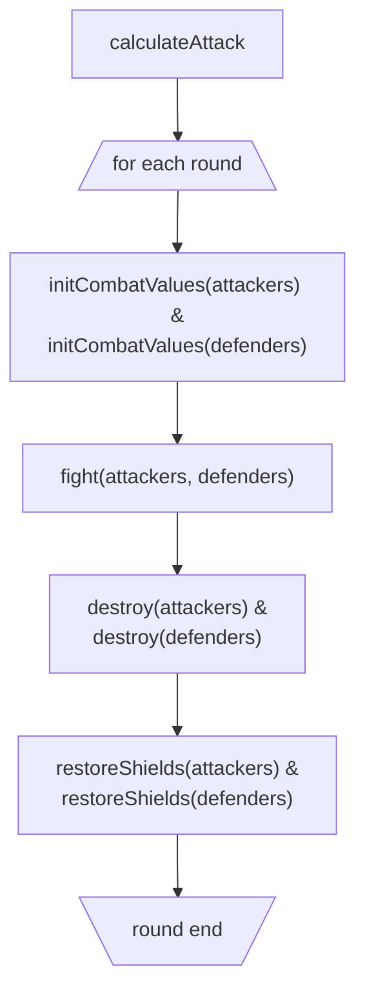

# Infos about pr0game battle engine

There are different engines available, most of them suck for some reason.
The current default is `SteemNova.php`

## `SteemNova.php`

Function flow

```mermaid
flowchart TD
  calculateAttack --> R[/"for each round"\]
  R --> a["initCombatValues(attackers) &\ninitCombatValues(defenders)"]
  a --> f["fight(attackers, defenders)"]
  f --> dd["destroy(attackers) &\ndestroy(defenders)"]
  dd --> rs["restoreShields(attackers) &\nrestoreShields(defenders)"]
  rs --> RE[\"round end"/]

```